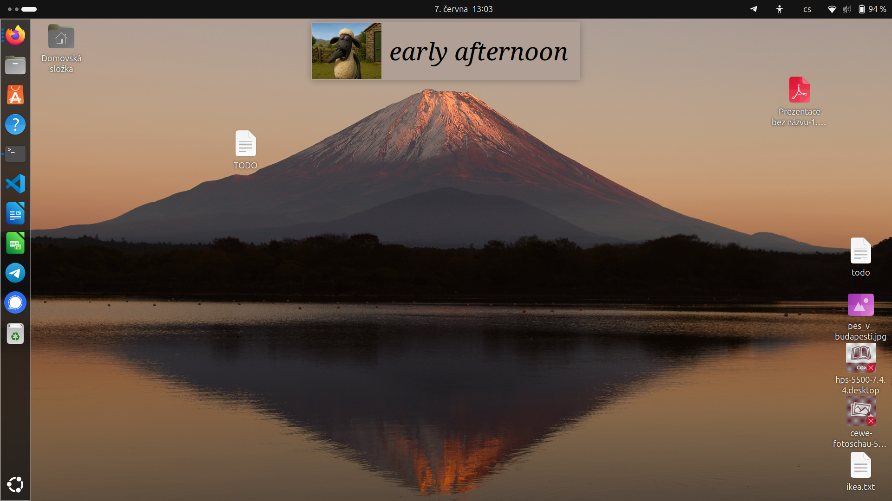

# time-in-words

A minimal desktop widget that tells the time as a *phrase* rather than digits —
`dawn`, `late morning`, `noon`, `dusk`, `night` — paired with a matching icon.
It sits on the desktop layer, Conky-style, behind your normal windows.



## How it works

The day is divided into named phases. The widget shows the phase that currently
applies (the latest phase whose start time has passed) and refreshes every 30
seconds. Each phase has an icon loaded from `imgs/<phase>.png`; if an icon is
missing the widget falls back to text only.

| Time          | Phrase           |
|---------------|------------------|
| 00:00–00:10   | midnight         |
| 00:10–03:00   | late night       |
| 03:00–05:30   | dawn             |
| 05:30–08:00   | early morning    |
| 08:00–10:30   | late morning     |
| 10:30–11:50   | before noon      |
| 11:50–12:30   | noon             |
| 12:30–15:00   | early afternoon  |
| 15:00–17:00   | late afternoon   |
| 17:00–18:30   | dusk             |
| 18:30–20:30   | evening          |
| 20:30–22:30   | late evening     |
| 22:30–23:50   | night            |
| 23:50–00:00   | midnight         |

## Requirements

- Python 3.10+ (uses modern type-hint syntax)
- [Tkinter](https://docs.python.org/3/library/tkinter.html) 8.6+ — usually
  bundled with Python; on Debian/Ubuntu install via `sudo apt install python3-tk`
- [Pillow](https://pillow.readthedocs.io/) for loading and scaling the icons:
  `pip install Pillow`

A window manager that honours `_NET_WM_WINDOW_TYPE_DESKTOP` gives the best
result (the widget renders as desktop content). On WMs that don't, it falls
back to staying lowered behind other windows.

## Usage

```bash
python3 time_in_words.py
```

To run it detached at login, add it to your WM/desktop autostart, e.g.:

```bash
nohup python3 /path/to/time_in_words.py >/dev/null 2>&1 &
```


The widget is clamped to the screen edges so it can't be dragged fully out of
view and lost.

## Configuration

There are no command-line flags or config files — tweak the constants near the
top of `time_in_words.py`:

| Constant       | Purpose                                                        |
|----------------|----------------------------------------------------------------|
| `PHASES`       | The time→phrase mapping (and which icons are looked for)       |
| `POLL_MS`      | Refresh interval in milliseconds (default 30 s)                |
| `TOP_OFFSET`   | Distance from the top of the screen on first placement         |
| `FONT_SPEC`    | Tk font tuple — family, size, style                            |
| `IMG_HEIGHT`   | Icon height in pixels (width scales proportionally)            |
| `IMG_RIGHT_GAP`| Transparent gap baked between the icon and the text            |
| `FG_COLOR`     | Text colour                                                    |
| `BG_COLOR`     | Background colour — sample this from your wallpaper at the widget's location for a fake-transparent look; update it when you change wallpaper |
| `ALPHA`        | Window opacity (0.0–1.0)                                        |

Icons live in `imgs/` and are named after their phrase with spaces replaced by
underscores (e.g. `early morning` → `imgs/early_morning.png`).

## Project layout

```
time_in_words.py    the widget (single file)
imgs/               one PNG per phrase
```
